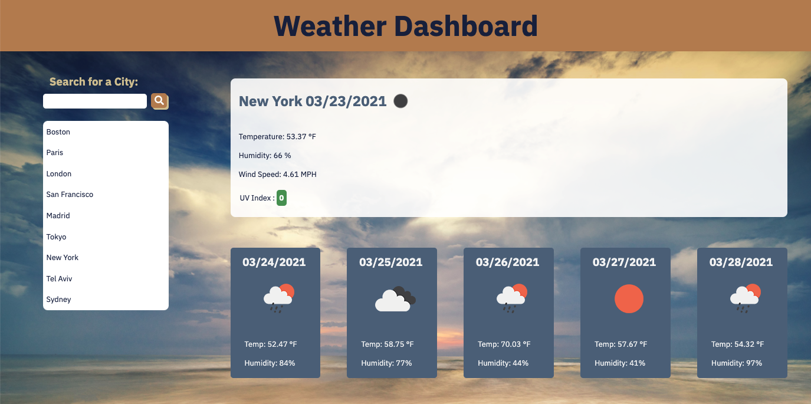

# weather-forecast-dashboard

## Description

The weather forecast dashboard is extracting weather forecast information utilizing AJAX to consume OpenWeather API endpoint.

Users can search for cities to display current weather including the UV index which is color coded based on its associated risk as well as forecast for the next 5 days.

The last 10 cities searched will be displayed under the search box and related weather information can be displayed by clicking on these previously searched cities.

In order to fully render the page, an API key is required and is not attached in GitHub, please use your own API key to take advantage of this tool.

